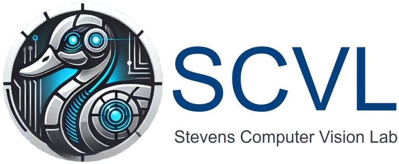
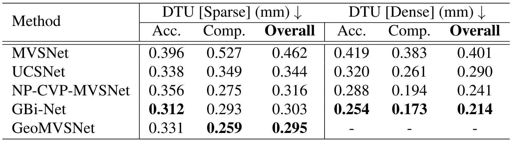

# MVS-Studio: A Collection and Unification of Several Deep Multi-View Stereo Networks

## About
<details open>
<summary></summary>

The motivation for this repository is to unify the current Multi-View Stereo network architectures into a single repository using the same network components to allow for a plug-and-play style framework for testing MVS architecture design. 
  
### Current Architectures
We are currently supporting the following network architectures:
-  MVSNet: Depth Inference for Unstructured Multi-view Stereo | [paper](https://openaccess.thecvf.com/content_ECCV_2018/papers/Yao_Yao_MVSNet_Depth_Inference_ECCV_2018_paper.pdf)
-  Non-parametric Depth Distribution Modelling based Depth Inference for Multi-view Stereo | [paper](https://openaccess.thecvf.com/content/CVPR2022/papers/Yang_Non-Parametric_Depth_Distribution_Modelling_Based_Depth_Inference_for_Multi-View_Stereo_CVPR_2022_paper.pdf)
-  Generalized Binary Search Network for Highly-Efficient Multi-View Stereo | [paper](https://openaccess.thecvf.com/content/CVPR2022/papers/Mi_Generalized_Binary_Search_Network_for_Highly-Efficient_Multi-View_Stereo_CVPR_2022_paper.pdf)

### Current Datasets
We are currently supporting the following datasets (see 'Data Preparation' for downloading each dataset):
-  DTU | [website](http://roboimagedata.compute.dtu.dk/?page_id=36)
-  Tanks & Temples | [website](https://www.tanksandtemples.org/)

### Association
<p align="left">
    <a href="https://www.stevens.edu/school-engineering-science/departments/computer-science/other-department-laboratories">
        <!-- pypi-strip -->
        <picture>
<!--         <source media="(prefers-color-scheme: dark)" srcset="assets/scvl_dark.png">
        <source media="(prefers-color-scheme: light)" srcset="assets/scvl_light.png"> -->
        <!-- /pypi-strip -->
        
        <!-- pypi-strip -->
        </picture>
        <!-- /pypi-strip -->
    </a>
  </p>
</details>

## Installation
<details open>
<summary></summary>
  
### Conda Environment
For our environment setup, we use [conda](https://www.anaconda.com/download/). Please install conda and run the following command:
```bash
conda create -n mvs_studio python=3.9
```

Once created, activate the environment:
```bash
conda activate mvs_studio
```

### Python Dependancies
With the conda environment activated, install the python dependencies:
```bash
pip install -r requirements.txt --user
```

This project uses [PyTorch](https://pytorch.org/) (currently supporting v2.2.2+cu118), please install the latest version:
```bash
pip install torch==2.2.2+cu118 torchvision==0.17.2+cu118 torchaudio==2.2.2+cu118 --index-url https://download.pytorch.org/whl/cu118
```

Please install [PyTorch3D](https://github.com/facebookresearch/pytorch3d) (currently supporting v0.7.6):
```bash
pip install git+https://github.com/facebookresearch/pytorch3d.git
```

Followed by [Tiny-Cuda-NN](https://github.com/NVlabs/tiny-cuda-nn) (currently supporting v1.7):
```bash
pip install git+https://github.com/NVlabs/tiny-cuda-nn/#subdirectory=bindings/torch
```

Lastly, please install [TorchSparse](https://github.com/mit-han-lab/torchsparse) (currently supporting v1.4.0):
```bash
sudo apt-get install libsparsehash-dev
```
```bash
pip install --upgrade git+https://github.com/mit-han-lab/torchsparse.git@v1.4.0
```
</details>

## Data Preparation
<details open>
<summary></summary>
  
We provide several datasets used in our experiments in an organized and consistent format:
- [DTU](https://stevens0-my.sharepoint.com/:f:/g/personal/nburgdor_stevens_edu/Eq8I4ewt8z1Hs9JHtYLSeaMBOWBnaMgofIUk_Gbj6gisYw?e=c06ddg)
- [TNT]() (coming soon...)
- [BlendedMVS]() (coming soon...)
- [Replica]() (coming soon...)
- [ScanNet]() (coming soon...)

If you would like to use your own data, please feel free to create a new class for the dataset in `src/datasets/<DATASET>.py`. Please feel free to look at any of the existing implementations for reference. They are all very similar. NOTE: The `BaseDataset` class in the `src/dataset/BaseDataset.py` file should not need updating to support new datasets. Only the `build_dataset` function at the top of the file would need updating to be able to locate and import the new dataset. You will receive an error specifying your dataset cannot be found if you forget to update this function. Additionally, please update the ```choices=["ScanNet", "Replica", "DTU", "TNT"]``` list for the ```--dataset``` argument in the ```src/config.py``` file with your new dataset name for argument parsing.
</details>

## Configuration
<details open>
<summary></summary>
  
Before running training or inference, please update the config file for the dataset you would like to run. The config files are located under `configs/<NETWORK>/<DATASET>/` (e.g. `configs/NP_CVP_MVSNet/DTU/DTU.yaml`). The only entries that need to be modified are the ones involving path information, shown in the following:

```yaml
data_path: <path-to-dataset>
output_path: <desired-output-path>
device: cuda:<desired-device-id>

eval:
  ckpt_file: <path-to-pretrained-model>
```
</details>

## Scripts
<details open>
<summary></summary>
  
We provide two scripts, one for running training ```scripts/training.sh``` and one for running inference ```scripts/inference.sh```. These scripts take three required arguments as input:
```bash
script <DATASET> <NETWORK> <GPU-ID-VISIBILITY>
```

Below is an examples of running our training script on the DTU database using the NP-CVP-MVSNet network using GPU with ID=1 as the visible GPU:
```bash
./scripts/training.sh DTU NP_CVP_MVSNet 1
```

And similar for running inference:
```bash
./scripts/inference.sh DTU NP_CVP_MVSNet 1
```

NOTE: We currently only support single GPU operation. This also effectively requires the following:
```yaml
device: cuda:0
```
</details>


## Training
<details open>
<summary></summary>
  
When training any of the networks from scratch, a `./log/` folder will be created in the top-level directory of the repository, storing the current configuration as well as checkpoints for each epoch during training. If you would like to continue training from a specific checkpoint or pretrained model, edit the config file to include the path to the checkpoint:
```yaml
training:
  ckpt_file: <path-to-model-checkpoint>
```
Please leave this key blank (or comment out the path) if you do not wish to continue training from some model checkpoint. The scenes that will be used for training and validation are the ones listed in the files `configs/<NETWORK>/<DATASET>/scene_lists/[training|validation].txt`. The format for this file is one scene per line (case-sensitive) (NOTE: empty lines will be counted as a scene. Please remove them before running the scripts).
</details>

## Inference
<details open>
<summary></summary>
  
We provide pretrained models for all methods:
- Trained on DTU
  - [MVSNet](https://stevens0-my.sharepoint.com/:f:/g/personal/nburgdor_stevens_edu/EpvpLPT9qMxOh3mbq5CYU4EBIcqLRH73TCu9gPnuuhKLIQ?e=gCOXCF)
  - [NP-CVP-MVSNet](https://stevens0-my.sharepoint.com/:f:/g/personal/nburgdor_stevens_edu/ErMJUQi9-9RAj7frhp9tXUEBMMko4rP1jgANXmu8AuSUxQ?e=YHxyc8)
  - [GBiNet](https://stevens0-my.sharepoint.com/:f:/g/personal/nburgdor_stevens_edu/EgriI5e8PNtKlITrrtNsQB4B1fcdDIl5_7fmlKYiDGvGhw?e=zX6sgG)

Run the inference script with the desired arguments as show above.

These bash scripts will run the `inference.py` python script with the appropriate config file and dataset tag. The scenes that will be processed are the ones listed in the file `configs/<NETWORK>/<DATASET>/scene_lists/inference.txt`. The format for this file is one scene per line (case-sensitive) (NOTE: empty lines will be counted as a scene. Please remove them before running the scripts). For the DTU dataset, the `inference.py` script automatically evaluates all point clouds output from our system following our dense evaluation script.
</details>

## Results
<details open>
<summary></summary>

<p align="left">
  <picture>
  
  </picture>
</p>

</details>
